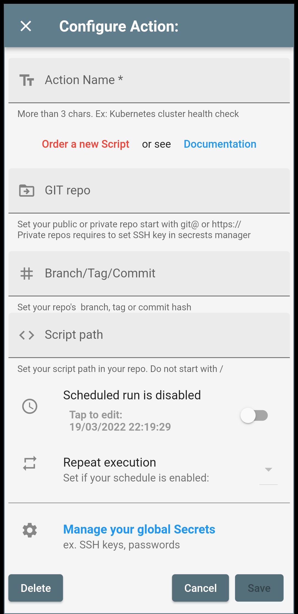
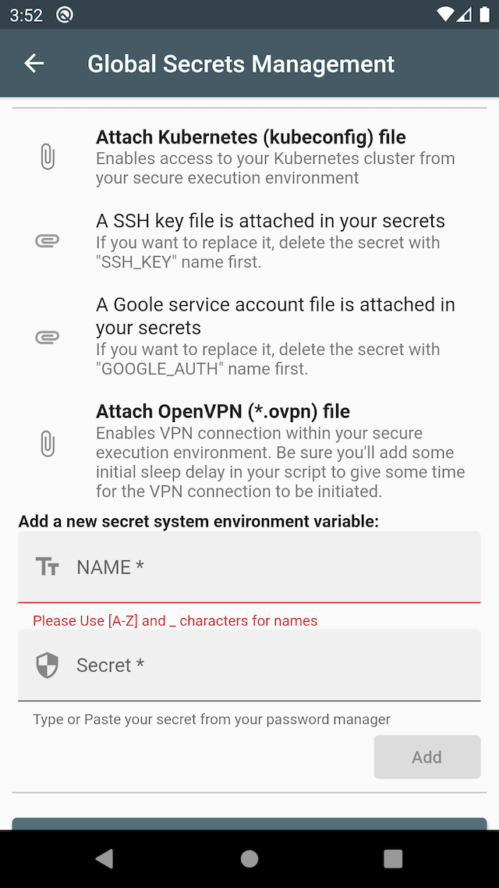

# Scripts Actions Documentation
Documentation and scripts examples for the [Script Actions App](https://play.google.com/store/apps/details?id=com.itforge.devopstool)

## Description
Run or schedule powerful pre-defined shell scripts from your phone in a secure temporary execution cloud environment.
It is a unique solution that provides easy and fast access in a secure execution environment with +100 Linux commands and tools available to use them from the phone with one tap! No laptops, no servers needed. 

**You can build, sell, load and execute scripts from public or private repositories.**

## Security
We use Kubernetes. Each execution environment, is dedicated with isolated storage, hardware and networking resources. 
The networking allows outbound traffic but inbound traffic is blocked.
Following the best practices, we are not storing credentials, API keys or other secrets. This information is injected on-demand in the temporary execution environment which is destroyed after the execution.

### If you interesting for a PaaS license (private infrastructure) please contact us from the contact form in-app.

## Use cases examples
* [Create simple curl requests to test your APIs availability](examples/curl.sh)
* [Use Cloud CLI tools to scale your infrastructure](examples/cloudclis.sh)
* [Access your Kubernetes cluster](examples/kubectl.sh)
* [SSH connection to remote hosts with/without server-side VPN](examples/sshwithvpn.sh)
* To execute Disaster Recovery Actions.
* For APIs or IT infrastructure health checks.
* For manual recovery actions cases.
* For business scheduled actions.
* For servers management or scaling.
* For profit & fun.
* You are not a Developer but you need a tested script ready to run it on your phone? [Let us know](https://github.com/itforgeuk/Script-Actions/discussions/1)

## How to build and test your scripts
### Requirements
* You need a Private or Public GIT repository. If your repository is private, don't forget to set its SSH key in-app secret manager.
* Be sure the code size in your branch must not exceed 15MB.
* Your code execution duration must not exceed the max execution time of your plan (5 - 20 mins), otherwise the application will terminate it.
* Local Docker engine. (See [How to install it](https://docs.docker.com/engine/install/))
* GIT (See how to install [git for windows](https://gitforwindows.org/))
* Development skills.

### Steps
1. Create your Git repository and clone it locally. If is private you can use a separate SSH key for this project and clone it with a command like
    >`GIT_SSH_COMMAND="ssh -i ~/.ssh/your-key " git clone git@github.com:youraccount/private-repo.git`
 
    or set core.sshCommand:
    >`git config core.sshCommand "ssh -i ~/.ssh/id_rsa_example -F /dev/null"`
2. Edit the .env file and set your reporitory details.
3. Run your script to test it locally:
    > Syntax example for public repository:

    >`docker run -it --rm --env-file .env itforgeuk/scriptactions:latest sh -c '/checkrepo.sh && chmod 755 /tmp/run.sh && /tmp/run.sh'` 
    
    > Syntax example for private repository:

    >`docker run -it --rm --env-file .env -v ~/.ssh/your_ssh_key:/tmp/.ssh/id_rsa itforgeuk/scriptactions:latest sh -c '/checkrepo.sh && chmod 755 /tmp/run.sh && /tmp/run.sh'`

    > Syntax example with Google Cloud Service Account authentication
    > `docker run -it --rm --env-file .env -v /full/path/google-auth.json:/tmp/google-auth.json itforgeuk/scriptactions:latest sh -c '/checkrepo.sh && chmod 755 /tmp/run.sh && /tmp/run.sh'`

    > Syntax example with Kubernetes authentication
    > `docker run -it --rm --env-file .env -v ~/.kube/config:/tmp/config itforgeuk/scriptactions:latest sh -c '/checkrepo.sh && chmod 755 /tmp/run.sh && /tmp/run.sh'`
<!-- TODO: Add run examples for openvpn -->

### Tips
* Try to minify your script output to get a more practical output in your app.
* Avoid build steps in your script that can produce data size over limits and slow execution.
* Test your credentials as env variables which will be the alternative of secrets manager in the app. DO NOT include them in your script only in .env file.

## How to run your scripts in app
Your script is well tested and published to your repo. You can now add it in the app:

1. Set your git repository in the "GIT repo" app field. The format for public github repos is:
    > https://github.com/yourrepo/yourproject

    or for private repos:
    > git@github.com:yourrepo/yourproject
2. Set your branch, tag or commit hash in the app field.
3. Set your script path in the app field. Do not start with '/'.
4. Set a shedule run if you like.
5. Save
6. Your script is ready.

## Questions
If you read **all the above** but you still have a question you can [write us](https://github.com/itforgeuk/Script-Actions/discussions/1)
